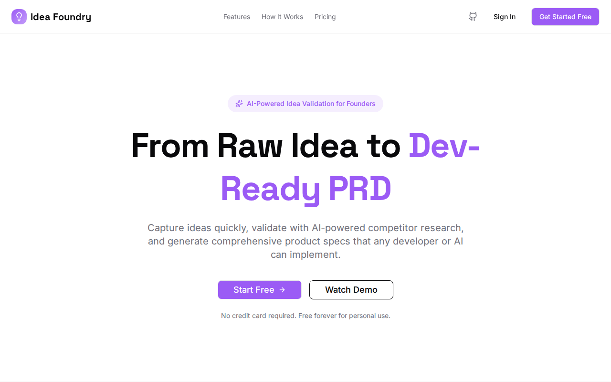

# Idea Foundry



An AI co-founder that helps you think through ideas before you sink time into them. Chat with it, get a viability score, generate a PRD, and walk away knowing whether to build or move on.

**Live at [ideafoundry.app](https://ideafoundry.app)**

## Why this exists

Most ideas die not because they're bad, but because they're underthought. You get excited, you start building, and three weeks in you realize the market's wrong or the problem isn't real. The cheapest fix is thinking harder *before* you write code — but most people don't have a co-founder to bounce ideas off of.

Idea Foundry is that co-founder. It adapts its mode — supportive when you need encouragement, challenger when you need honesty. It scores viability, maps competition, and turns the conversation into a structured PRD you can actually hand to a developer.

## What it does

- **AI Co-Founder chat** — supportive or challenger mode, adapts to your stage
- **Viability scoring** — market potential, competition, problem-solution fit
- **PRD generation** — turns conversations into structured product requirements
- **Synergy analysis** — finds cross-promotion opportunities across your projects
- **Voice interaction** — speak your ideas, hear the feedback (client-side TTS/STT)
- **GitHub export** — push generated PRDs directly to a repo

## How it's built

- **React + Vite + TailwindCSS + shadcn/ui** — frontend
- **Node.js + Express** — serverless-ready API (Vercel)
- **PostgreSQL via Drizzle ORM** — Neon Postgres in production
- **Google Gemini + Anthropic Claude** — provider routing with automatic failover; if Gemini's down, Claude picks up
- **Supabase Auth** — magic link authentication

The AI routing is the interesting piece — it's not just "call the API." It routes across providers with per-request failover, so a Gemini outage doesn't take the app down. Each provider has its own adapter, and the service layer picks based on availability and cost.

## Run it locally

```bash
npm install
cp .env.example .env          # Add your database URL + AI keys
npm run db:push               # Sync schema to your database
npm run dev                   # http://localhost:5000
```

## License

Proprietary. All rights reserved.
